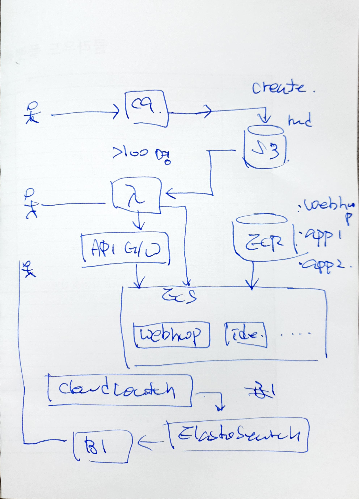

# 웹한글 기안기 API 학습 서비스

# 요구사항
1. Markdown으로 쉽게 매뉴얼 작성
2. 각 단계에 WebIDE를 통해서 예제 코드 자동 입력 or 쉽게 입력
3. 응답속도 500ms 이내
4. 동시접속 최대 100명

# Architecture


# 개발 환경
## AWS CLI
### 설치
-   Windows:  [MSI installer](https://docs.aws.amazon.com/cli/latest/userguide/install-cliv2-windows.html)
-   macOS:  [Bundled installer](https://docs.aws.amazon.com/cli/latest/userguide/install-cliv2-mac.html)
-   Linux:  [CLI install](https://docs.aws.amazon.com/cli/latest/userguide/install-cliv2-linux.html)

### AWS configure

```
$ aws configure
AWS Access Key ID [None]: <key ID 입력>
AWS Secret Access Key [None]: <access key 입력>
Default region name [None]: <region 선택>
Default output format [None]: <입력하지 않아도 됨.>
```

## NVM 설치
```
$ curl -o- https://raw.githubusercontent.com/nvm-sh/nvm/v0.38.0/install.sh | bash
```
## Node.js 설치
```
$ nvm install node
```

## CDK 설치
```bash
# 설치
$ npm install -g aws-cdk

# 버전 확인
$ cdk --version
1.118.0 (build a4f0418)

# bootstrap
$ cdk bootstrap aws://your-account/your-region
```

```
$ npm install
```

# TODO
* 미작업 요구사항 구현
* Markdown 매뉴얼 작성위한 Pipeline 서비스 추가
* ECS에서 efsVolumeConfiguration Volume Attach 미지원
https://docs.aws.amazon.com/cdk/api/latest/docs/aws-ecs-readme.html
https://github.com/aws/aws-cdk/issues/6918
=> 아래 방법 적용
```js
task = FargateTaskDefinition(self, "Task",...);

container = task.add_container("container", ...);

container_volume_mount_point = ecs.MountPoint(
    read_only=False,
    container_path="/bitnami/wordpress",
    source_volume=efs_volume.name
);
container.add_mount_points(container_volume_mount_point);
```
* Cross Domain 리소스 접근 이슈(웹한글 기안기 CORS Policy 수정?) 해결
* SSR 구조 반영

# 참고
## CDK
* https://docs.aws.amazon.com/cdk/index.html
* https://cdkworkshop.com/
* https://docs.aws.amazon.com/cdk/api/latest/docs/aws-construct-library.html
* https://github.com/aws-samples/aws-cdk-examples

### ECS
* https://aws.amazon.com/ko/getting-started/hands-on/deploy-docker-containers/
* https://docs.aws.amazon.com/AmazonECS/latest/developerguide/tutorial-ecs-web-server-cdk.html

### EKS
* https://cdk-eks-devops.workshop.aws/en/

### Serverless Application(Lambda, API G/W, S3)
* https://docs.aws.amazon.com/cdk/latest/guide/serverless_example.html

### React in AWS Lambda
* https://aws.amazon.com/blogs/compute/building-server-side-rendering-for-react-in-aws-lambda/

### Sample to deploy React SSR on Lambda
* https://github.com/aws-samples/react-ssr-lambda

### Cloud9
* https://docs.aws.amazon.com/cloud9/latest/user-guide/sample-cdk.html

## Useful commands

 * `npm run build`   compile typescript to js
 * `npm run watch`   watch for changes and compile
 * `npm run test`    perform the jest unit tests
 * `cdk deploy`      deploy this stack to your default AWS account/region
 * `cdk diff`        compare deployed stack with current state
 * `cdk synth`       emits the synthesized CloudFormation template
